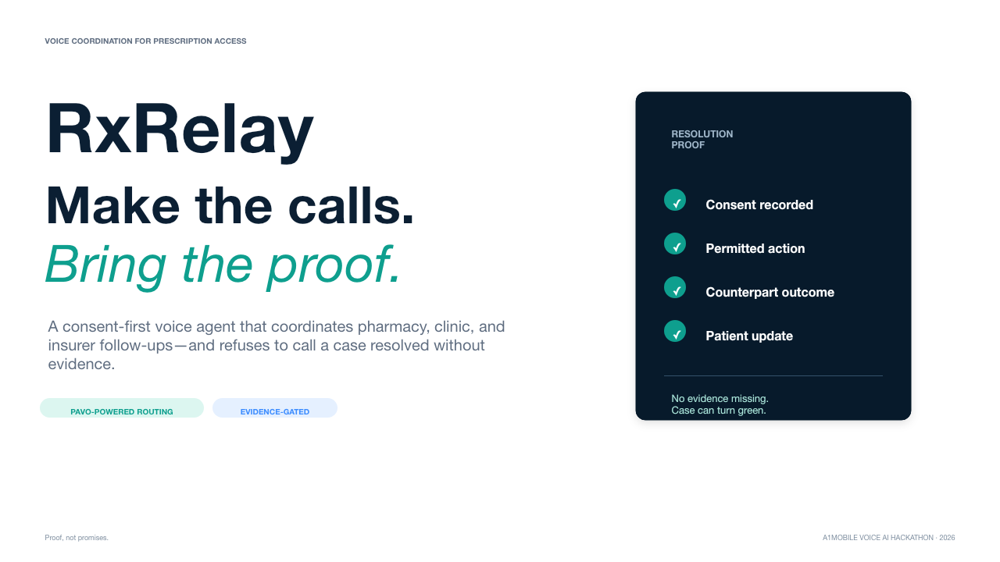
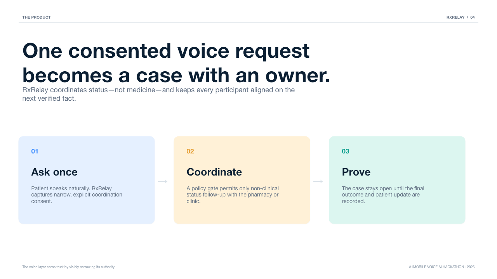
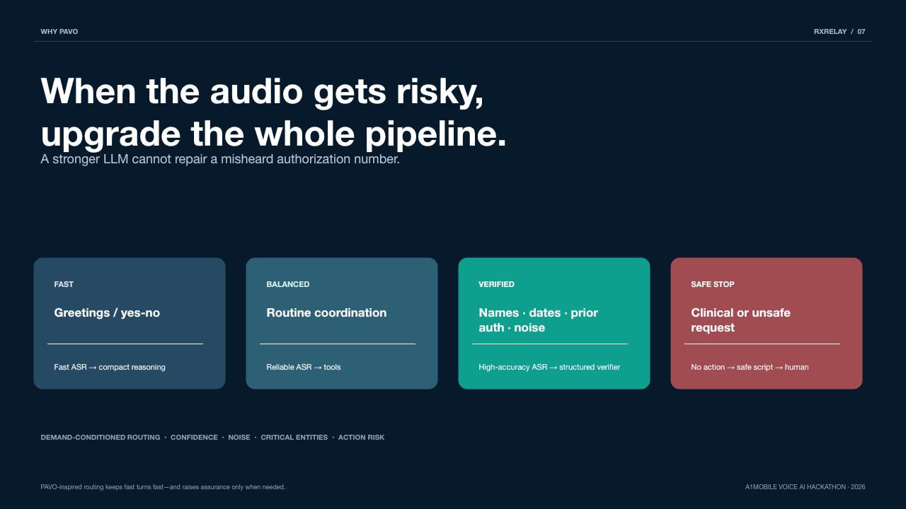
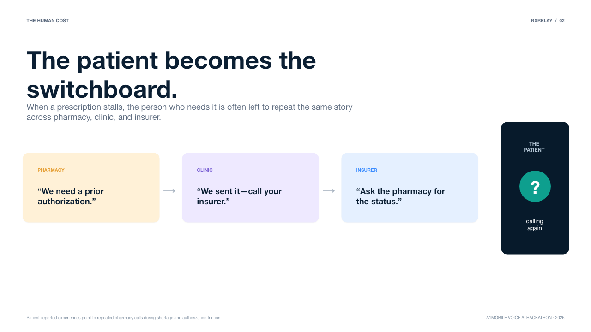
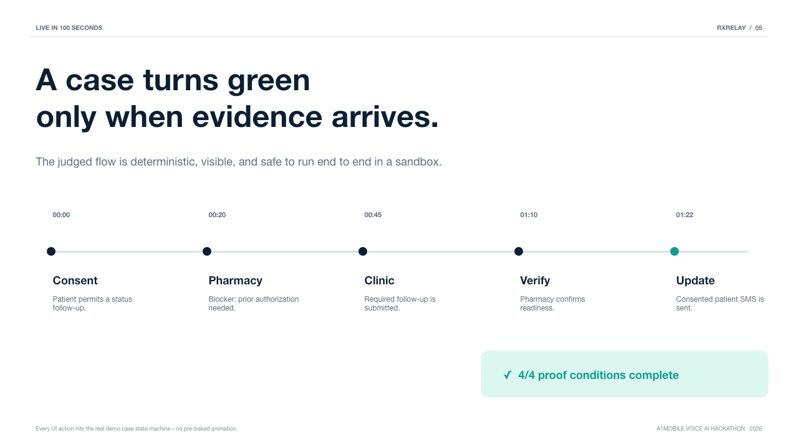
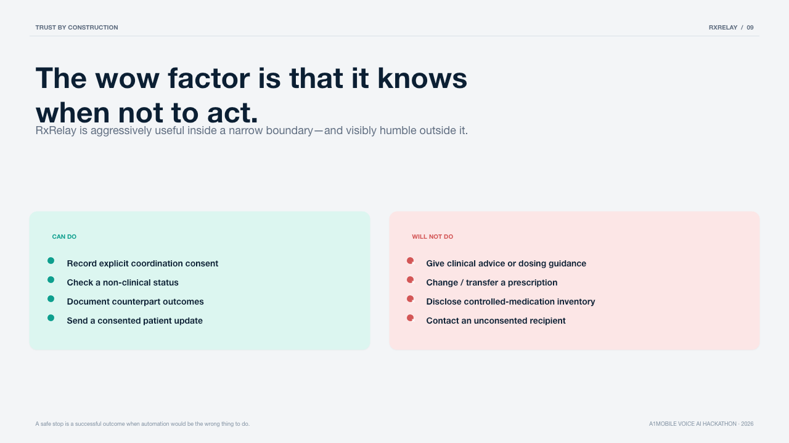

<div align="center">



# RxRelay

### A voice agent that has to **prove** it helped.

Consent-first voice coordination for prescription access.  
A case can close only when **consent ∧ action ∧ counterpart outcome ∧ patient update** are on the record — not when an LLM says “done.”

[](https://vnmoorthy.github.io/rxrelay/)
[](https://vnmoorthy.github.io/rxrelay/deck/pitch.html)
[](LICENSE)
[](package.json)
[](package.json)

[](https://github.com/vnmoorthy/rxrelay/actions/workflows/ci.yml)
[](test/rxrelay.test.mjs)
[](https://github.com/vnmoorthy/pavo-bench)
[](docs/A1MOBILE_LIVE_SETUP.md)

[Website](https://vnmoorthy.github.io/rxrelay/) · [Judge demo](docs/JUDGE_DEMO.md) · [Pitch deck](https://vnmoorthy.github.io/rxrelay/deck/pitch.html) · [PPTX](deck/output/RxRelay_Hackathon_Pitch.pptx) · [Quickstart](#-quickstart) · [Proof gate](#-the-proof-gate) · [Paper](https://openreview.net/forum?id=zrneoIxlFx)

</div>

---

## ✅ Product completeness (v0.2)

Everything judges need for demo + evaluation is shipped and tested.

| Surface | Status |
| --- | --- |
| Consent + deterministic 4/4 proof gate | **Works** (tested) |
| Pharmacy→clinic→ready→SMS proof path | **Works** (sandbox E2E; voice + dashboard) |
| Inbound TeXML voice (`voice-server.mjs`) | **Works** (isolated blast radius) |
| PAVO demand routing + safe-stop | **Works**; verified turns upgrade speech+DTMF + strong model |
| Signed hash-chained proof receipts | **Works** (`/api/cases/:id/receipt`) |
| Counterpart attestation (pharmacy/clinic) | **Works** (`/attest/:token` — attestation seam without EHR) |
| Human ops queue + resume + timeout scan | **Works** |
| Live SSE proof stream | **Works** (`/api/events`) |
| MCP tools (8) | **Works** |
| Marketing site + 13-slide HTML/PPTX deck | **Shipped** |
| Outbound SMS + coordination call adapters | **Works** — sandbox always; live carrier path is intentionally fail-closed until OTP allowlist + `ALLOW_LIVE_TELEPHONY` / call-action URL (safety, not a missing feature) |

## 📖 Table of contents

- [Why this exists](#-why-this-exists)
- [The proof gate](#-the-proof-gate)
- [Screenshots](#-screenshots)
- [Architecture](#-architecture)
- [Quickstart](#-quickstart)
- [Live inbound voice](#-live-inbound-voice)
- [PAVO routing](#-pavo-route-the-pipeline-not-just-the-model)
- [Safety contract](#-safety-contract)
- [MCP tools](#-mcp-tools)
- [How it compares](#-how-it-compares)
- [Hackathon criteria](#-built-for-the-a1mobile-voice-ai-hackathon-2026)
- [Related work](#-related-work)
- [Repository map](#-repository-map)
- [Contributing](#-contributing)

**Demo number (live inbound):** `+1 (802) 676-8127` · full judge script: [`docs/JUDGE_DEMO.md`](docs/JUDGE_DEMO.md)

---

## ⚡ Why this exists

A prescription can be clinically approved and still be unreachable. Something stalls — prior auth, stock, a missing form — and the patient becomes the switchboard:

**call pharmacy → call clinic → call insurer → repeat context → still no trustworthy answer.**

Voice agents are an obvious fit for that loop. The failure mode is subtler:

> An agent that *says* “I’ve taken care of it” and an agent that *actually coordinated something* look identical at the transcript layer.

In medication access, that gap is the whole risk.

**RxRelay closes the gap by refusing to close a case it cannot substantiate.**

| Generic voice agent | RxRelay |
| --- | --- |
| “I’ll take care of it.” | “Here is the evidence I can prove.” |
| One inference path for every turn | PAVO-style routing across ASR **and** reasoning |
| Conversation ends ⇒ task done | Case stays open until the proof gate is satisfied |
| Treats every request as automatable | Hard-stops clinical advice, Rx changes, emergency cues, controlled-inventory questions |
| Failed API call still narrates success | Failed provider call records **no** action evidence |

---

## 🔐 The proof gate

This is the core idea, and it is deliberately boring: **an LLM never decides that a case is resolved.** A pure function over recorded state does.

```js
// src/store.mjs — the close gate is not generative
function resolutionProof(caseRecord) {
  const checks = [
    { id: "consent",      label: "Explicit consent recorded",               passed: caseRecord.evidence.consentRecorded },
    { id: "action",       label: "Permitted coordination action completed", passed: caseRecord.evidence.permittedActionCompleted },
    { id: "outcome",      label: "Counterpart outcome recorded",            passed: caseRecord.evidence.counterpartOutcomeRecorded },
    { id: "notification", label: "Patient notification sent",               passed: caseRecord.evidence.patientNotificationSent },
  ];
  return { checks, ready: checks.every((check) => check.passed) };
}
```

```text
 consent  ∧  permitted action  ∧  counterpart outcome  ∧  patient update
 ───────     ────────────────     ──────────────────     ──────────────
 recorded    provider-accepted    pharmacy/clinic fact   consented SMS
                 (or sandbox)
                              │
                              ▼
                     Resolution verified
                   (every other state stays open)
```

| Property | How it is enforced |
| --- | --- |
| **No action before consent** | `requireConsent()` throws on every coordination and messaging path |
| **No fabricated completions** | Evidence flags are set by state transitions, never by model output |
| **Failure is visible** | A rejected provider call leaves `permittedActionCompleted === false` |
| **Partial progress stays open** | Clinic submission ≠ resolved Rx; pharmacy confirmation is still required |

There is a dedicated honesty test — a provider that throws must not manufacture action evidence:

```js
test("failed outbound coordination cannot create a false action proof", async () => {
  const failingTelephony = { placeCoordinationCall: async () => { throw new Error("Provider unavailable"); } };
  const store = new CaseStore({ telephony: failingTelephony });
  await assert.rejects(() => store.beginCoordination("RX-1048"), /Provider unavailable/);
  assert.equal(store.get("RX-1048").evidence.permittedActionCompleted, false);
});
```

---

## 🖥️ Screenshots

| Proof board | Architecture | PAVO routing |
| :---: | :---: | :---: |
|  |  |  |
| Deterministic close gate | End-to-end system topology | Demand-conditioned pipelines |

| Problem framing | Live demo flow | Safety contract |
| :---: | :---: | :---: |
|  |  |  |

Full narrative deck: [HTML](https://vnmoorthy.github.io/rxrelay/deck/pitch.html) · [PPTX](deck/output/RxRelay_Hackathon_Pitch.pptx) (`npm run deck`)

---

## 🏗 Architecture

Two processes. One shared case file. The public tunnel only ever touches the TeXML voice gateway — never the dashboard or MCP surface.

```text
  Caller (consented)
        │
        ▼
 ┌──────────────────────────────────────────┐
 │  Cloudflare quick tunnel                 │
 │  (scripts/live-inbound.mjs)              │
 └────────────────────┬─────────────────────┘
                      │ TeXML only
                      ▼
 ┌──────────────────────────────────────────┐     ┌──────────────────────────────────────────┐
 │  voice-server.mjs :3001                  │     │  server.mjs :3000                         │
 │  /voice  /voice/turn  /health            │     │  proof board · /api/cases · /mcp          │
 │  token-gated · no dashboard · no MCP     │     │  webhook seam · demo lab                  │
 └────────────────────┬─────────────────────┘     └────────────────────┬─────────────────────┘
                      │                                                │
                      └──────────────────┬─────────────────────────────┘
                                         ▼
                           ┌─────────────────────────┐
                           │  shared CaseStore       │
                           │  persist → data/cases.json
                           └───────────┬─────────────┘
                                       │
              ┌────────────────────────┼────────────────────────┐
              ▼                        ▼                        ▼
        pavo.mjs                 inference.mjs            telephony.mjs
   demand-conditioned         OpenAI Responses           sandbox | fail-closed
        routing                 + local fallback              live adapter
```

Deep dive: [`docs/ARCHITECTURE.md`](docs/ARCHITECTURE.md) · **full diagram:** [`docs/ARCHITECTURE_DIAGRAM.md`](docs/ARCHITECTURE_DIAGRAM.md) · pitch architecture slide in [`assets/architecture.png`](assets/architecture.png).


---

## 🚀 Quickstart

```bash
git clone https://github.com/vnmoorthy/rxrelay.git
cd rxrelay
cp .env.example .env
npm test        # 27 tests · node:test · no install step
npm run deck    # rebuild PPTX → deck/output/… ; HTML at deck/pitch.html
npm run dev     # http://localhost:3000
```

There is nothing to `npm install`. The sandbox demo has **zero runtime dependencies** — Node 20+ provides the HTTP server, test runner, `--env-file-if-exists`, and `fetch`.

Default mode is `TELEPHONY_PROVIDER=demo` with `ALLOW_LIVE_TELEPHONY=false`, so the entire flow runs without dialing or texting a real person.

**Pitch deck**
- Live HTML: [vnmoorthy.github.io/rxrelay/deck/pitch.html](https://vnmoorthy.github.io/rxrelay/deck/pitch.html)
- Local HTML: [`deck/pitch.html`](deck/pitch.html) (fullscreen · ← → · `N` notes)
- PPTX: `npm run deck` → [`deck/output/RxRelay_Hackathon_Pitch.pptx`](deck/output/RxRelay_Hackathon_Pitch.pptx)

### Demo in 100 seconds

1. Open **RX-1048** (consent already recorded).
2. **Call pharmacy** → sandbox coordination action.
3. **Record blocker** → prior authorization needed.
4. **Record clinic step** → follow-up submitted.
5. **Confirm readiness** → pharmacy outcome + consented sandbox SMS.
6. Watch the close gate turn green only at **4/4**.
7. Try an uncertain / unsafe turn in the PAVO lab — upgrade the pipeline or safe-stop; never invent completion.

Full script (dashboard sandbox): [`docs/DEMO.md`](docs/DEMO.md) · **judge live call:** [`docs/JUDGE_DEMO.md`](docs/JUDGE_DEMO.md) (`+18026768127`)

---

## 📞 Live inbound voice

`voice-server.mjs` is a deliberately isolated TeXML gateway. It shares cases with the dashboard through `data/cases.json`.

```bash
npm run dev            # proof board on :3000
npm run live:inbound   # voice :3001 → Cloudflare tunnel → point claimed number
```

Then call the claimed number and say:

> I consent to a pharmacy status follow-up and text updates.

> [!IMPORTANT]
> **Inbound voice ≠ outbound messaging.** Live SMS/calls stay disabled until `ALLOW_LIVE_TELEPHONY=true` **and** `LIVE_ALLOWED_RECIPIENTS` contains OTP-verified numbers. The live adapter refuses completion without a provider-issued action id.
>
> OTP helpers:
> ```bash
> npm run verify -- +1XXXXXXXXXX
> npm run confirm -- +1XXXXXXXXXX 123456
> ```
>
> Details: [`docs/A1MOBILE_LIVE_SETUP.md`](docs/A1MOBILE_LIVE_SETUP.md)

---

## 🔬 PAVO: route the pipeline, not just the model

Grounded in **[PAVO: Pipeline-Aware Voice Orchestration with Demand-Conditioned Inference Routing](https://openreview.net/forum?id=zrneoIxlFx)**.

> **A better LLM cannot repair a misheard authorization number.**

When a turn is uncertain or carries a critical entity, RxRelay upgrades **transcription and reasoning together**.

| Route | Triggered by | Pipeline |
| --- | --- | --- |
| **Fast** | greetings, simple confirmations | fast ASR → compact reasoning |
| **Balanced** | routine status coordination | reliable ASR → tool-aware reasoning |
| **Verified** | noise, low ASR confidence, names/numbers/dates, prior auth, contradiction | high-accuracy ASR → structured verifier |
| **Safe stop** | clinical advice, emergency cues, Rx changes, controlled inventory, identity data | **no autonomous action** → human handoff |

Safe stop is checked **first**. The router is a readable pure function in [`src/pavo.mjs`](src/pavo.mjs).

Research: [paper](https://openreview.net/forum?id=zrneoIxlFx) · [pavo-bench](https://github.com/vnmoorthy/pavo-bench)

---

## 🛡 Safety contract

RxRelay does **not**:

- give medical advice or interpret symptoms
- prescribe, change, refill, or transfer a prescription
- determine insurance coverage or eligibility
- disclose controlled-medication inventory
- contact anyone without explicit, scope-limited consent

Urgent medical cues are a **handoff**, not an automation opportunity. Voice consent requires both a consent phrase **and** a scope term (`pharmacy` / `status` / `coordinate` / `text` / `update`).

Live mode is a configuration decision, never a code-path accident.

---

## 🔌 MCP tools

`POST /mcp` exposes JSON-RPC tools that share the **same** consent + proof gate as the UI:

| Tool | Purpose |
| --- | --- |
| `create_rx_case` | Create a consent-gated coordination case |
| `record_consent` | Record explicit patient consent |
| `begin_coordination_call` | Start a non-clinical pharmacy status call |
| `record_external_outcome` | Record `pharmacy_blocker` · `clinic_submission` · `pharmacy_ready` |
| `issue_counterpart_link` | Issue a single-use pharmacy/clinic/insurer attestation link |
| `export_proof_receipt` | Export a signed hash-chained proof receipt |
| `get_case_brief` | Return status + deterministic resolution proof |
| `list_human_queue` | List cases held for human review |

No tool can bypass the proof gate.

---

## 🥊 How it compares

| | RxRelay | Typical voice agent demo | Human switchboard |
| --- | --- | --- | --- |
| Completion claim | Deterministic proof gate | Conversational “done” | Memory / sticky notes |
| Uncertain audio | Upgrade ASR **and** reasoning (PAVO) | Hope the LLM repairs it | Ask the patient to repeat |
| Clinical / emergency language | Safe stop → human | Often continues | Escalates unevenly |
| Failed provider call | No action evidence recorded | Often narrates success | Unknown |
| Outbound contact | OTP allowlist + consent | Frequently unconstrained | Manual |
| Public blast radius | Voice-only process | Full app exposed | N/A |

---

## 🏆 Built for the a1mobile Voice AI Hackathon 2026

| Criterion | Evidence |
| --- | --- |
| Idea & creativity | Moves voice agents from talking → evidence-backed access coordination |
| Real-world value | Removes patient-as-switchboard work in prescription access |
| Technical execution | Case state machine, PAVO routing, TeXML gateway, counterpart portal, signed receipts, human ops, SSE, MCP (8), proof gate, CI + 27 tests |
| Voice UX | Voice-first consent, confirmation on uncertain critical details, explicit safe stops |
| Works live | Sandbox E2E today; real inbound TeXML path; live outbound fails closed until provider accepts + returns an id |

---

## 🧠 Related work

**Research**

- [PAVO Bench](https://github.com/vnmoorthy/pavo-bench) — pipeline-aware voice inference routing + [paper](https://openreview.net/forum?id=zrneoIxlFx)

**Systems by the same author**

- [Groundtruth](https://github.com/vnmoorthy/groundtruth) — refuse “done” without evidence (same philosophy, coding agents)
- [Lifeline](https://github.com/vnmoorthy/lifeline) — evidence-gated voice safety patterns
- [MCP Observatory](https://github.com/vnmoorthy/mcpobservatory) — tool timeline / replay ideas in the case trail
- Also: [Verdict](https://github.com/vnmoorthy/verdict) · [Cohort](https://github.com/vnmoorthy/cohort) · [AlphaSignal](https://github.com/vnmoorthy/alphasignal) · [LaunchDay](https://github.com/vnmoorthy/launchday)

---

## 📁 Repository map

```text
src/pavo.mjs              PAVO-inspired demand-conditioned routing (pure function)
src/inference.mjs         Guarded OpenAI-compatible client + local fallback
src/dialogue.mjs          Phone turn shaping, ASR repairs, TeXML Say helpers
src/voice-lexicon.mjs     Consent / intent paraphrase expansion
src/voice-training/       Mined lexicon + few-shot exemplars for Maya
src/store.mjs             Consent-gated case state machine + proof gate
src/persist.mjs           Shared local JSON store for dashboard + voice
src/telephony.mjs         Sandbox adapter + fail-closed live provider adapter
src/receipt.mjs           Signed hash-chained proof receipts
src/counterpart.mjs       Magic-link attestation tokens
src/bus.mjs               Case event bus for live SSE
server.mjs                HTTP API, webhook seam, MCP endpoint, proof board
voice-server.mjs          Token-protected TeXML inbound gateway
scripts/                  live:inbound · point · verify · confirm
public/                   Proof-board dashboard
site/                     Marketing site → GitHub Pages
assets/                   Social preview + pitch visuals for the README
docs/                     Architecture, live setup, DEMO, JUDGE_DEMO
deck/                     13-slide HTML + PPTX (`npm run deck`)
test/                     node:test suite (27) — routing, consent, proof honesty
```

---

## 🤝 Contributing

See [`CONTRIBUTING.md`](CONTRIBUTING.md) and the [`CODE_OF_CONDUCT.md`](CODE_OF_CONDUCT.md).

```bash
npm run check
npm test
```

Security reports: [`SECURITY.md`](SECURITY.md) — especially anything that could fabricate proof or skip consent.

## License

[MIT](LICENSE)
