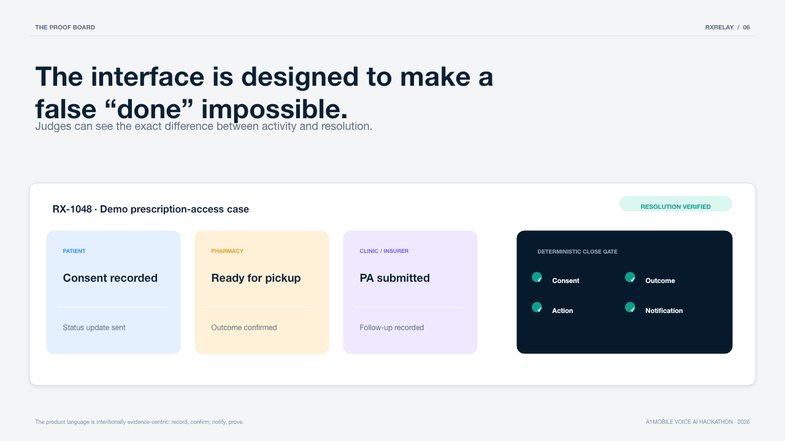

# RxRelay

> **Medication access should not depend on a patient becoming the switchboard.**

RxRelay is a consent-first voice coordinator for prescription-access follow-ups. A patient can call in, grant narrow permission, and let RxRelay coordinate a non-clinical status check across the pharmacy and clinic/insurer. It closes a case only when it can show the evidence—not when an agent merely says it did the work.

**Proof, not promises.**



## The problem

When a prescription stalls, people often have to call the pharmacy, clinic, and insurer repeatedly, repeat the same context, and still have no trustworthy answer. Community reports describe calling many pharmacies and making repeated status calls during shortages or authorization delays. RxRelay is built for the operational gap around the prescription—not for prescribing or clinical decisions.

## What it does

1. Takes a **consented** inbound voice request or normalized telephony webhook.
2. Uses **PAVO-inspired pipeline routing** to select the right ASR/reasoning path for the turn.
3. Coordinates only permitted, non-clinical status follow-ups.
4. Shows a visible, deterministic case-resolution proof board.
5. Sends a consented status update and keeps the case open if any evidence is missing.

The included sandbox runs the entire live-demo sequence without dialing or texting a real person.

## Why this is different

Most agent demos optimize for a smooth conversation. RxRelay optimizes for an honest outcome.

| A generic voice agent | RxRelay |
| --- | --- |
| “I’ll take care of it.” | “Here is the evidence I can prove.” |
| One inference path | PAVO-style pipeline routing across ASR, reasoning, and verification |
| Conversation ends | A case remains open until its proof gate is satisfied |
| Treats all requests alike | Safely stops clinical advice, prescription changes, emergency cues, and controlled-inventory queries |

## Live demo in 100 seconds

1. Open **RX-1048**. Consent is already recorded for the sandbox patient.
2. Select **Call pharmacy**—the sandbox adapter records the coordination action.
3. Select **Record blocker**—the pharmacy reports a prior-authorization need.
4. Select **Record clinic step**—the clinic submits the required follow-up.
5. Select **Confirm readiness**—the pharmacy outcome is recorded and a consented sandbox SMS is produced.
6. Watch the close gate turn green only when all four checks are present.
7. Try an uncertain or unsafe voice turn in the PAVO lab. Notice that RxRelay escalates the whole pipeline or safely hands off; it never invents a completion.

## Architecture

```mermaid
flowchart LR
  subgraph Access[Consented patient access]
    Phone["Inbound phone / text\nOTP-verified recipient"]
    UI["RxRelay proof board\nvoice + web demo"]
  end
  subgraph Voice[Voice ingress and PAVO routing]
    Webhook["a1mobile / Vapi / LiveKit\nnormalized webhook"]
    Guard{"Consent + safety\npolicy gate"}
    Router["PAVO-inspired router\nASR confidence • noise • entities • action risk"]
    Fast["Fast\nASR → compact reasoning"]
    Balanced["Balanced\nreliable ASR → tool-aware reasoning"]
    Verified["Verified\nhigh-accuracy ASR → structured verifier"]
    Stop["Safe stop\nscript + human review"]
  end
  subgraph Case[Evidence-first case engine]
    Case["Case state\nminimum necessary coordination facts"]
    Policy["Permitted action policy\nno medical advice / no prescribing / no Rx changes"]
    Proof{"Deterministic resolution proof\nconsent ∧ action ∧ counterpart outcome ∧ patient update"}
    Timeline["Event timeline\nredacted demo records"]
  end
  subgraph Counterparts[Consent-limited counterpart actions]
    Pharmacy["Pharmacy status\nsandbox / approved integration"]
    Clinic["Clinic / insurer follow-up\nsandbox / approved integration"]
    Human["Human coordinator\nexception and safety queue"]
  end
  Phone --> Webhook --> Guard
  UI --> Guard
  Guard -- denied / unsafe --> Stop --> Human
  Guard -- allowed --> Router
  Router --> Fast --> Case
  Router --> Balanced --> Case
  Router --> Verified --> Case
  Case --> Policy
  Policy --> Pharmacy --> Case
  Policy --> Clinic --> Case
  Case --> Proof --> Timeline
  Proof -- evidence missing --> Human
  Proof -- verified --> Phone
  Timeline --> UI
```

The [expanded architecture](docs/ARCHITECTURE.md) includes data boundaries, failure behavior, and the a1mobile integration seam.

## PAVO: routing the full voice pipeline

RxRelay is grounded in **PAVO: Pipeline-Aware Voice Orchestration with Demand-Conditioned Inference Routing**. The key product implication is simple: an uncertain voice turn should upgrade **transcription and reasoning together**. A better LLM cannot repair a misheard authorization number.

| Route | Used for | Pipeline behavior |
| --- | --- | --- |
| Fast | greetings, simple confirmations | fast ASR → compact reasoning → voice |
| Balanced | routine status coordination | reliable ASR → tool-aware reasoning → voice |
| Verified | noisy audio, names/numbers/dates, prior auth, contradiction | high-accuracy ASR → structured reasoning → deterministic verifier |
| Safe stop | clinical advice, emergency cues, prescription changes, controlled-inventory queries | no autonomous action → safe script → human handoff |

PAVO research: [paper](https://openreview.net/forum?id=zrneoIxlFx) · [benchmark and routing assets](https://github.com/vnmoorthy/pavo-bench)

## Safety contract

RxRelay does **not** provide medical advice, prescribe, change or transfer prescriptions, determine coverage, disclose controlled-medication inventory, or contact people without explicit consent. It treats urgent medical cues as a safe handoff, not an automation opportunity.

The demo defaults to `TELEPHONY_PROVIDER=demo`; calls and texts are represented as sandbox events only. Live operation remains blocked until a team supplies:

- OTP-verified, explicitly consented test recipients;
- a1mobile phone number and current provider schema / MCP endpoint;
- public webhook URL and verification secret;
- configured OpenAI-compatible model key; and
- an approved human escalation owner.

See [live configuration](docs/A1MOBILE_LIVE_SETUP.md) before changing `ALLOW_LIVE_TELEPHONY`.

## Run locally

```bash
git clone https://github.com/vnmoorthy/rxrelay.git
cd rxrelay
cp .env.example .env
npm test
npm run dev
```

Open <http://localhost:3000>. There are no runtime dependencies to install for the sandbox demo.

## MCP tools

The product exposes a compact JSON-RPC MCP endpoint at `POST /mcp` with:

- `create_rx_case`
- `record_consent`
- `begin_coordination_call`
- `record_external_outcome`
- `get_case_brief`

This lets an a1mobile-orchestrated agent use the same consent and evidence guardrails as the web demo.

## Built for the a1mobile Voice AI Hackathon

| Hackathon criterion | RxRelay evidence |
| --- | --- |
| Idea & creativity | Shifts voice agents from “talking” to evidence-backed access coordination |
| Real-world value | Reduces patient-as-switchboard work in prescription access follow-ups |
| Technical execution | Full state machine, PAVO routing, webhook seam, MCP endpoint, deterministic proof gate |
| Voice UX | Voice-first consent, confirmation on uncertain critical details, explicit safe stops |
| Works live | Complete sandbox end-to-end demo today; provider adapter is isolated for allotted a1mobile credentials |

## Related work by the author

- [PAVO Bench](https://github.com/vnmoorthy/pavo-bench) — pipeline-aware voice inference routing research and artifacts.
- [Lifeline](https://github.com/vnmoorthy/lifeline) — evidence-gated voice safety patterns that informed RxRelay’s completion gate.
- [MCP Observatory](https://github.com/vnmoorthy/mcpobservatory) — tool timeline and replay ideas reflected in the case event trail.

## Repository map

```text
src/pavo.mjs          PAVO-inspired demand-conditioned routing
src/inference.mjs     Guarded OpenAI-compatible Responses client with local fallback
src/store.mjs         Consent-gated case state machine and proof gate
src/telephony.mjs     Sandbox + provider-isolated telephony adapter
server.mjs            HTTP API, webhook seam, and MCP endpoint
public/               Live case-resolution proof-board dashboard
docs/                 Architecture, live setup, demo script
deck/                 10-slide hackathon pitch deck source and output
```

## License

[MIT](LICENSE)
