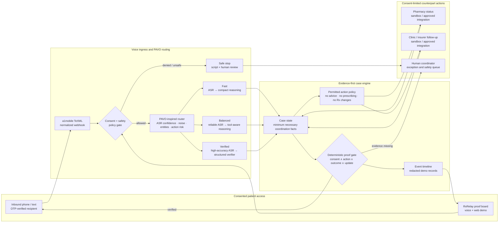

<div align="center">

# RxRelay

### **A voice agent that has to prove it helped.**

Consent-first voice coordination for prescription access — where a case can only close
when **consent ∧ action ∧ counterpart outcome ∧ patient update** are all on the record.

[**Website**](https://vnmoorthy.github.io/rxrelay/) · [**Architecture**](docs/ARCHITECTURE.md) · [**Demo script**](docs/DEMO.md) · [**PAVO paper**](https://openreview.net/forum?id=zrneoIxlFx)

[](LICENSE)
[](package.json)
[](package.json)
[](test/rxrelay.test.mjs)
[](https://github.com/vnmoorthy/pavo-bench)
[](docs/A1MOBILE_LIVE_SETUP.md)

<br />


</div>

---

## Medication access should not depend on a patient becoming the switchboard

A prescription can be clinically approved and still be unreachable. Something stalls — a prior
authorization, a stock issue, a form nobody sent — and the resolution path becomes a human loop:
call the pharmacy, call the clinic, call the insurer, repeat the same context to each one, and
end the day without a trustworthy answer.

Voice agents are an obvious fit for that loop. The problem is that most of them are graded on
whether the conversation *sounded* resolved. An agent that says "I've taken care of it" and an
agent that actually coordinated something are indistinguishable at the transcript layer — and in
medication access, that gap is the whole risk.

**RxRelay closes the gap by refusing to close a case it cannot substantiate.**

<table>
<tr><th align="left" width="50%">A generic voice agent</th><th align="left" width="50%">RxRelay</th></tr>
<tr><td>"I'll take care of it."</td><td>"Here is the evidence I can prove."</td></tr>
<tr><td>One inference path for every turn</td><td>PAVO-style routing across ASR <em>and</em> reasoning</td></tr>
<tr><td>The conversation ends, so the task is done</td><td>The case stays open until its proof gate is satisfied</td></tr>
<tr><td>Treats every request as automatable</td><td>Hard-stops clinical advice, Rx changes, emergency cues, controlled-inventory questions</td></tr>
<tr><td>A failed API call still narrates success</td><td>A failed provider call records <em>no</em> action evidence</td></tr>
</table>

---

## The proof gate

This is the core idea, and it is deliberately boring: **an LLM never decides that a case is
resolved.** A pure function over recorded state does.

```js
// src/store.mjs
function resolutionProof(caseRecord) {
  const checks = [
    { id: "consent",      label: "Explicit consent recorded",             passed: caseRecord.evidence.consentRecorded },
    { id: "action",       label: "Permitted coordination action completed", passed: caseRecord.evidence.permittedActionCompleted },
    { id: "outcome",      label: "Counterpart outcome recorded",          passed: caseRecord.evidence.counterpartOutcomeRecorded },
    { id: "notification", label: "Patient notification sent",             passed: caseRecord.evidence.patientNotificationSent },
  ];
  return { checks, ready: checks.every((check) => check.passed) };
}
```

Four consequences fall out of that shape:

| Property | How it is enforced |
| --- | --- |
| **No action before consent** | `requireConsent()` throws on every coordination and messaging path |
| **No fabricated completions** | Evidence flags are set by state transitions, never by model output |
| **Failure is visible** | A rejected provider call leaves `permittedActionCompleted === false`, so the gate stays red |
| **Partial progress stays open** | A recorded clinic submission is *not* a resolved prescription; an independent pharmacy confirmation is still required |

There is a test for the honesty case specifically — a provider that throws must not be able to
manufacture action evidence:

```js
// test/rxrelay.test.mjs
test("failed outbound coordination cannot create a false action proof", async () => {
  const failingTelephony = { placeCoordinationCall: async () => { throw new Error("Provider unavailable"); } };
  const store = new CaseStore({ telephony: failingTelephony });
  await assert.rejects(() => store.beginCoordination("RX-1048"), /Provider unavailable/);
  assert.equal(store.get("RX-1048").evidence.permittedActionCompleted, false);
});
```

---

## Architecture



[docs/ARCHITECTURE.md](docs/ARCHITECTURE.md) adds the request sequence, trust boundaries, the case
state machine, failure behavior, and the a1mobile integration seam.

---

## Quickstart

```bash
git clone https://github.com/vnmoorthy/rxrelay.git
cd rxrelay
cp .env.example .env
npm test        # 10 tests, node:test, no install step
npm run dev     # http://localhost:3000
```

There is nothing to `npm install`. The sandbox demo has **zero runtime dependencies** — Node 20+
provides the HTTP server, test runner, `--env-file-if-exists`, and `fetch`.

The default `.env.example` ships as `TELEPHONY_PROVIDER=demo` and `ALLOW_LIVE_TELEPHONY=false`, so
the entire flow runs end to end without dialing or texting a real person.

### Run the demo in 100 seconds

1. Open **RX-1048**. Consent is already recorded for the sandbox patient.
2. **Call pharmacy** — the sandbox adapter records the coordination action.
3. **Record blocker** — the pharmacy reports that a prior authorization is needed.
4. **Record clinic step** — the clinic submits the required follow-up.
5. **Confirm readiness** — the pharmacy outcome is recorded and a consented sandbox SMS is produced.
6. Watch the close gate turn green only once all four checks are present.
7. Try an uncertain or unsafe turn in the PAVO lab. RxRelay upgrades the whole pipeline or safely
   hands off — it never invents a completion.

Full narration in [docs/DEMO.md](docs/DEMO.md).

### Run the real inbound voice path

The project includes a deliberately isolated TeXML voice gateway. `voice-server.mjs` exposes only
`GET/POST /voice`, `GET/POST /voice/turn`, and `/health` — no dashboard, no MCP endpoint. It shares
case state with the dashboard through `data/cases.json`.

With `npm run dev` already running on port 3000:

```bash
npm run live:inbound
```

That starts the voice gateway on `VOICE_PORT` (default 3001), opens a Cloudflare quick tunnel to
**that process only**, and points the claimed number via `POST /api/numbers/point`. Call the number
and say:

> I consent to a pharmacy status follow-up and text updates.

The new voice case appears in the proof board's case picker.

> [!IMPORTANT]
> **Inbound voice does not enable outbound messaging.** Live outbound calls and SMS stay disabled
> until `ALLOW_LIVE_TELEPHONY=true` *and* `LIVE_ALLOWED_RECIPIENTS` contains OTP-verified,
> explicitly consented numbers. The live adapter also refuses to record a completion unless the
> provider returns an action id. See [docs/A1MOBILE_LIVE_SETUP.md](docs/A1MOBILE_LIVE_SETUP.md).

---

## PAVO: route the pipeline, not just the model

RxRelay's routing is grounded in **PAVO: Pipeline-Aware Voice Orchestration with
Demand-Conditioned Inference Routing**. The product implication is a single sentence:

> **A better LLM cannot repair a misheard authorization number.**

When a turn is uncertain or carries a critical entity, RxRelay upgrades **transcription and
reasoning together** — because the failure that matters in medication access happens upstream of
the language model.

| Route | Triggered by | Pipeline behavior |
| --- | --- | --- |
| **Fast** | greetings, simple confirmations | fast ASR → compact reasoning → voice |
| **Balanced** | routine status coordination, deeper history | reliable ASR → tool-aware reasoning → voice |
| **Verified** | low ASR confidence, noise, names/numbers/dates, prior auth, contradiction | high-accuracy ASR → structured reasoning → deterministic verifier |
| **Safe stop** | clinical advice, emergency cues, Rx changes, controlled-inventory, identity data | no autonomous action → safe script → human handoff |

Safe stop is checked **first**, before any confidence math, and it sets `humanReview` on the case
so no downstream action can proceed. The router is a readable ~100-line pure function in
[`src/pavo.mjs`](src/pavo.mjs) — inspect it, don't trust it.

Research: [paper](https://openreview.net/forum?id=zrneoIxlFx) · [benchmark and routing assets](https://github.com/vnmoorthy/pavo-bench)

---

## Safety contract

RxRelay does **not**:

- give medical advice or interpret symptoms;
- prescribe, change, refill, or transfer a prescription;
- determine insurance coverage or eligibility;
- disclose controlled-medication inventory;
- contact anyone without explicit, scope-limited consent on the record.

It treats urgent medical cues as a **handoff**, not an automation opportunity. Consent is narrow by
construction: the voice path requires both a consent phrase *and* a scope term (pharmacy / status /
coordinate / text / update) before `consentRecorded` is set.

Live operation is a configuration decision, never a code-path accident. It requires OTP-verified
consented recipients, a claimed a1mobile number with confirmed action endpoints, a public webhook
URL and verification secret, a configured OpenAI-compatible model key, and a named human escalation
owner.

---

## MCP tools

`POST /mcp` exposes a compact JSON-RPC MCP server so an orchestrator can drive RxRelay through the
*same* consent and evidence guardrails as the web demo:

| Tool | Purpose |
| --- | --- |
| `create_rx_case` | Create a consent-gated coordination case |
| `record_consent` | Record explicit patient consent before any activity |
| `begin_coordination_call` | Begin a non-clinical pharmacy status call for a consented case |
| `record_external_outcome` | Record a counterpart result (`pharmacy_blocker` · `clinic_submission` · `pharmacy_ready`) |
| `get_case_brief` | Return case status plus the deterministic resolution proof |

No tool can bypass the proof gate. `begin_coordination_call` on a case without consent throws, and
`get_case_brief` returns the same four checks the dashboard renders.

---

## Built for the a1mobile Voice AI Hackathon 2026

| Criterion | Evidence |
| --- | --- |
| Idea & creativity | Moves voice agents from talking to evidence-backed access coordination |
| Real-world value | Removes patient-as-switchboard work in prescription access follow-ups |
| Technical execution | Case state machine, PAVO routing, TeXML gateway, webhook seam, MCP endpoint, deterministic proof gate, 10 tests |
| Voice UX | Voice-first consent, confirmation on uncertain critical details, explicit safe stops |
| Works live | Complete sandbox demo today; real inbound TeXML voice path; live outbound fails closed until a provider accepts a consented action and returns an id |

---

## Related work

**Research**

- [PAVO Bench](https://github.com/vnmoorthy/pavo-bench) — pipeline-aware voice inference routing: benchmark, routing assets, and the [paper](https://openreview.net/forum?id=zrneoIxlFx) behind RxRelay's router.

**Systems by the same author**

- [Lifeline](https://github.com/vnmoorthy/lifeline) — evidence-gated voice safety patterns that informed the completion gate.
- [MCP Observatory](https://github.com/vnmoorthy/mcpobservatory) — tool timeline and replay ideas reflected in the case event trail.
- More: [Groundtruth](https://github.com/vnmoorthy/groundtruth) · [Verdict](https://github.com/vnmoorthy/verdict) · [Cohort](https://github.com/vnmoorthy/cohort) · [AlphaSignal](https://github.com/vnmoorthy/alphasignal) · [LaunchDay](https://github.com/vnmoorthy/launchday)

---

## Repository map

```text
src/pavo.mjs          PAVO-inspired demand-conditioned routing (pure function)
src/inference.mjs     Guarded OpenAI-compatible Responses client with local fallback
src/store.mjs         Consent-gated case state machine and the proof gate
src/persist.mjs       Shared local JSON case store for dashboard + voice
src/telephony.mjs     Sandbox adapter + fail-closed live provider adapter
server.mjs            HTTP API, webhook seam, MCP endpoint
voice-server.mjs      Token-protected TeXML inbound-phone gateway
scripts/              Live inbound tunnel + number-point helpers
public/               Case-resolution proof-board dashboard
site/                 Static marketing site published to GitHub Pages
docs/                 Architecture, live setup, demo script
deck/                 10-slide hackathon pitch deck source and output
test/                 node:test suite covering routing, consent, and the proof gate
```

## Contributing

Issues and pull requests are welcome. Before opening a PR:

```bash
npm run check   # syntax check across every entrypoint
npm test        # node:test suite
```

Two rules matter more than style: **no code path may set an evidence flag from model output**, and
**no outreach may occur without a recorded, scope-limited consent**.

## License

[MIT](LICENSE)
