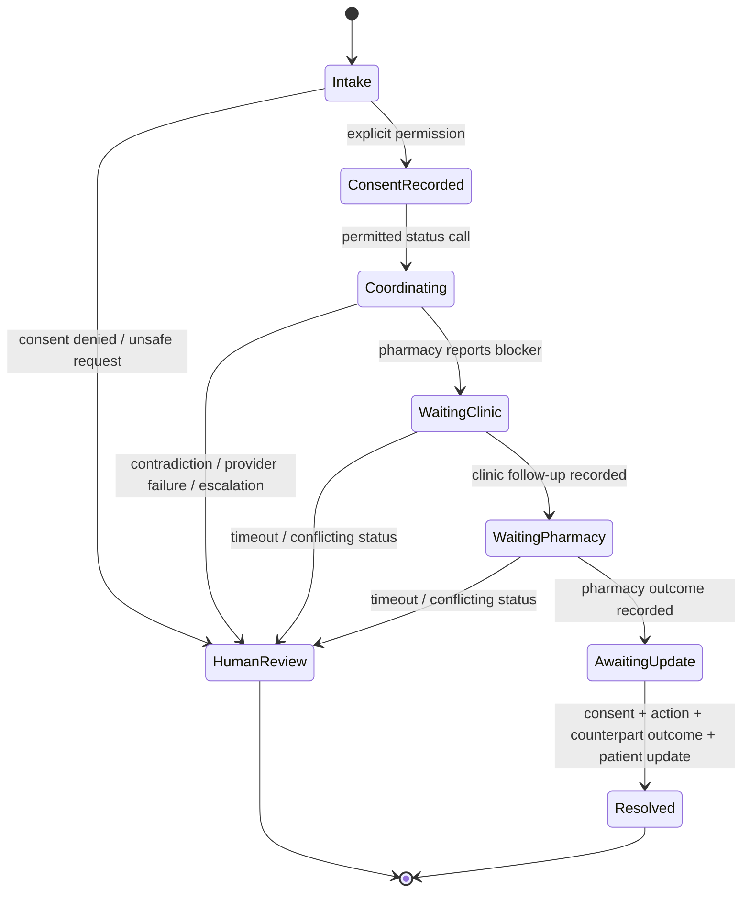

# RxRelay architecture

RxRelay has one non-negotiable property: **a narration of work is not evidence of completion.** The system stores a case as a small, auditable state machine, and lets deterministic proof—not an LLM—decide whether a case may become “resolved.”

```mermaid
sequenceDiagram
  autonumber
  participant P as Patient (consented)
  participant A as a1mobile / webhook
  participant R as PAVO router
  participant C as RxRelay case engine
  participant X as Pharmacy / clinic sandbox
  participant H as Human coordinator
  P->>A: inbound call / text
  A->>R: transcript + audio confidence + noise
  R->>R: demand-condition ASR + inference tier
  alt Unsafe request or urgent cue
    R->>C: safe-stop event
    C->>H: human-review case; no autonomous outreach
  else Explicit consent and permitted status action
    R->>C: create/update minimal case facts
    C->>X: coordinate status only
    X->>C: counterpart outcome
    C->>C: check consent ∧ action ∧ outcome ∧ notification
    alt All evidence exists
      C->>P: consented update
      C->>C: resolution verified
    else Evidence absent or contradictory
      C->>H: hold open for human follow-up
    end
  end
```

## Trust boundaries

| Boundary | What crosses it | RxRelay control |
| --- | --- | --- |
| Patient → voice layer | voice/transcript, consent language | redacts demo content; routes unsafe requests to handoff |
| Voice layer → PAVO | confidence/noise plus route-worthy signals | upgrades ASR and inference together on uncertain critical audio |
| PAVO → action layer | an intent, never raw authority | policy engine checks consent and permitted-action scope |
| Action layer → counterpart | narrow non-clinical status request | provider adapter isolates exact a1mobile schema; default mode is sandbox |
| Counterpart → proof gate | recorded outcome | deterministic state transition, never inferred “success” |
| Proof gate → patient | a consented update | required evidence before the case can resolve |

## Case state machine



## a1mobile seam

`src/telephony.mjs` contains the only provider-specific boundary. The product can be connected in either direction:

1. **Inbound** — set the a1mobile destination to `POST /api/telephony/a1mobile/events`; normalize `eventId`, transcript, audio confidence, and noise into the documented payload.
2. **Outbound** — replace the two isolated adapter methods (`placeCoordinationCall`, `sendPatientUpdate`) with the confirmed a1mobile REST/MCP call schema.
3. **MCP** — point an orchestration layer at `POST /mcp` and use the listed tools. Every tool shares the same consent and proof gate.

Live mode is a deliberate configuration change, never a code-path accident. See [A1MOBILE_LIVE_SETUP.md](A1MOBILE_LIVE_SETUP.md).
