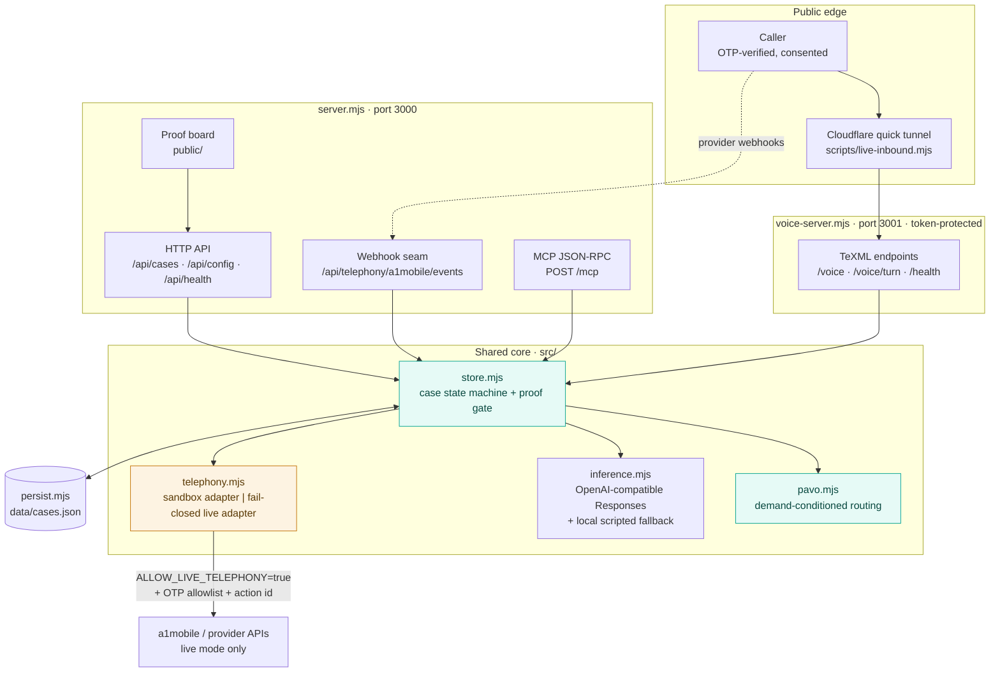
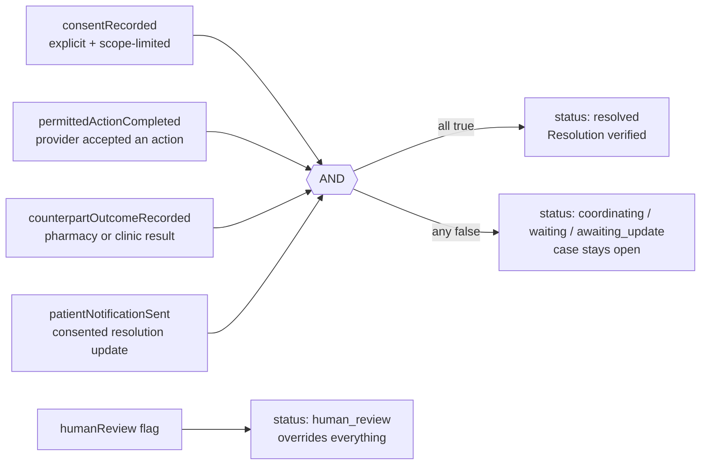
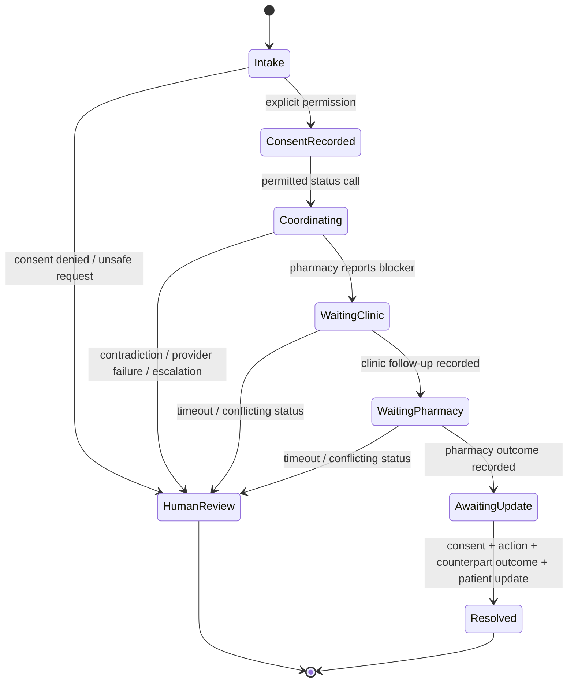
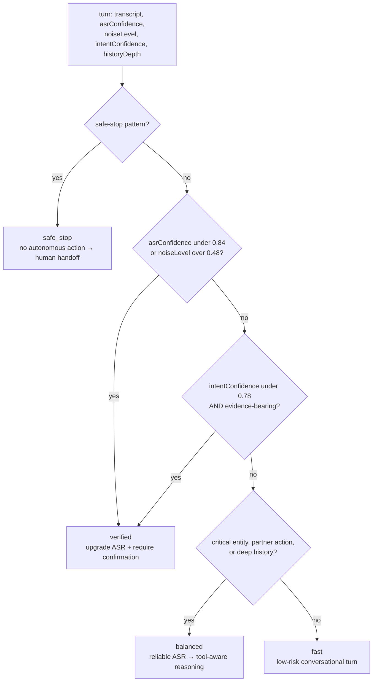

# RxRelay architecture

RxRelay has one non-negotiable property: **a narration of work is not evidence of completion.** The
system stores a case as a small, auditable state machine, and lets deterministic proof—not an
LLM—decide whether a case may become “resolved.”

Everything below follows from that. The router chooses how carefully to listen, the policy engine
chooses what may be attempted, and the proof gate chooses what may be called done. Those are three
separate decisions made by three separate mechanisms, and only the middle one involves a model.

---

## System topology

Two processes, one shared case file. The voice gateway is deliberately isolated: if it is exposed
through a public tunnel, that tunnel reaches a process with no dashboard, no MCP endpoint, and no
outbound provider credentials in its request path.



**Why the split matters.** `voice-server.mjs` and `server.mjs` share state only through
`data/cases.json` via `persist.mjs`. Every mutation reloads, applies, and saves, so a case created
by a phone call appears in the dashboard picker without either process holding a socket to the
other. The blast radius of exposing the voice gateway is one narrow TeXML surface.

---

## Request lifecycle

```mermaid
sequenceDiagram
  autonumber
  participant P as Patient (consented)
  participant A as a1mobile / webhook
  participant R as PAVO router
  participant C as RxRelay case engine
  participant X as Pharmacy / clinic
  participant H as Human coordinator
  P->>A: inbound call / text
  A->>R: transcript + audio confidence + noise
  R->>R: demand-condition ASR + inference tier
  alt Unsafe request or urgent cue
    R->>C: safe-stop event
    C->>H: human-review case; no autonomous outreach
  else Explicit consent and permitted status action
    R->>C: create/update minimal case facts
    C->>X: coordinate status only
    X->>C: counterpart outcome
    C->>C: check consent ∧ action ∧ outcome ∧ notification
    alt All evidence exists
      C->>P: consented update
      C->>C: resolution verified
    else Evidence absent or contradictory
      C->>H: hold open for human follow-up
    end
  end
```

---

## Trust boundaries

| Boundary | What crosses it | RxRelay control |
| --- | --- | --- |
| Patient → voice layer | voice/transcript, consent language | redacts demo content; routes unsafe requests to handoff |
| Voice layer → PAVO | confidence/noise plus route-worthy signals | upgrades ASR and inference together on uncertain critical audio |
| PAVO → action layer | an intent, never raw authority | policy engine checks consent and permitted-action scope |
| Action layer → counterpart | narrow non-clinical status request | provider adapter isolates exact a1mobile schema; default mode is sandbox |
| Counterpart → proof gate | recorded outcome | deterministic state transition, never inferred “success” |
| Proof gate → patient | a consented update | required evidence before the case can resolve |
| Voice gateway → app | shared case file only | separate process, separate port, token-protected, no MCP or dashboard surface |

---

## The proof gate

`resolutionProof()` in `src/store.mjs` is a pure function over recorded state. It takes no model
output, no transcript, and no confidence score.



`deriveStatus()` checks `humanReview` **first**. A case flagged for human review can never present
as resolved, regardless of how much evidence has accumulated.

### Ordering constraints

The gate is a conjunction, but the transitions that set its flags are ordered, so partial progress
cannot masquerade as completion:

- `recordClinicSubmission()` throws unless a pharmacy blocker is already recorded.
- `recordPharmacyReady()` throws unless a clinic submission is already recorded.
- `sendPatientUpdate()` only sets `patientNotificationSent` when the reason is `resolution_update` —
  an interim status text does not satisfy the notification check.
- Every one of the above calls `requireConsent()` first.

---

## Case state machine



---

## PAVO routing

`src/pavo.mjs` is a pure function. It evaluates safe-stop patterns before any confidence math, so no
amount of clean audio can route a clinical-advice request into an automated path.



The chosen tier is stored on the case as `lastRoute` and rendered on the proof board, so a judge can
see which pipeline handled each turn and why.

`src/inference.mjs` maps the tier onto a model class. If no OpenAI-compatible gateway is configured,
it falls back to a local scripted reply — the demo degrades to deterministic language rather than
failing, and the proof gate is unaffected either way.

---

## Failure behavior

Every failure mode below resolves toward *less* claimed progress, never more.

| Failure | Behavior |
| --- | --- |
| Provider call rejected or throws | The exception propagates before `permittedActionCompleted` is set; the gate stays red |
| Live action returns no id | `A1MobileAdapter.dispatch()` throws rather than record a completion |
| Recipient not on the OTP allowlist | Outbound refuses in both sandbox and live paths |
| Live env vars incomplete | `assertLiveReady()` throws and names the missing keys |
| Duplicate provider webhook | `eventId` dedupe returns `{ deduplicated: true }` with no case mutation |
| Inbound caller ≠ consented recipient | Webhook rejected in live provider mode |
| Model gateway unreachable | Scripted local reply; routing and proof gate unchanged |
| Unsafe or urgent turn | `humanReview` set; status overridden to human review |

---

## Data handling

- Cases hold **minimum necessary coordination facts**: an alias, a recipient, a medication label, and
  event summaries. There is no clinical record, no diagnosis, and no coverage determination.
- Patient identity is an alias (`Caller • 0088`), not a name, on voice-originated cases.
- State lives in a local JSON file (`data/cases.json`, git-ignored). There is no external database
  and nothing is transmitted anywhere in sandbox mode.
- `.env` is git-ignored. No key, team key, or token belongs in the repo, the site, or the deck.

---

## a1mobile seam

`src/telephony.mjs` contains the only provider-specific boundary. The product can be connected in
either direction:

1. **Inbound (webhook)** — set the a1mobile destination to
   `POST /api/telephony/a1mobile/events`. `normalizeA1MobileEvent()` accepts both camelCase and
   snake_case payloads and normalizes `eventId`, transcript, audio confidence, and noise.
2. **Inbound (TeXML)** — run `npm run live:inbound`, which starts the isolated voice gateway, opens a
   quick tunnel to it, and points the claimed number at `/voice`.
3. **Outbound** — the two isolated adapter methods (`placeCoordinationCall`, `sendPatientUpdate`)
   post to configured action URLs and require a provider-issued id in the response.
4. **MCP** — point an orchestration layer at `POST /mcp`. Every tool shares the same consent and
   proof gate as the dashboard.

Live mode is a deliberate configuration change, never a code-path accident:
`createTelephonyAdapter()` returns the sandbox adapter unless **both**
`TELEPHONY_PROVIDER=a1mobile` and `ALLOW_LIVE_TELEPHONY=true` are set. Inbound voice works without
either. See [A1MOBILE_LIVE_SETUP.md](A1MOBILE_LIVE_SETUP.md).

---

## What is intentionally not here

- No clinical reasoning, triage, or dosing logic of any kind.
- No autonomous scheduling, no payment, no coverage determination.
- No "confidence score" standing in for evidence — a probability never satisfies a proof check.
- No retry loop that could convert a provider failure into an eventual claimed success.
