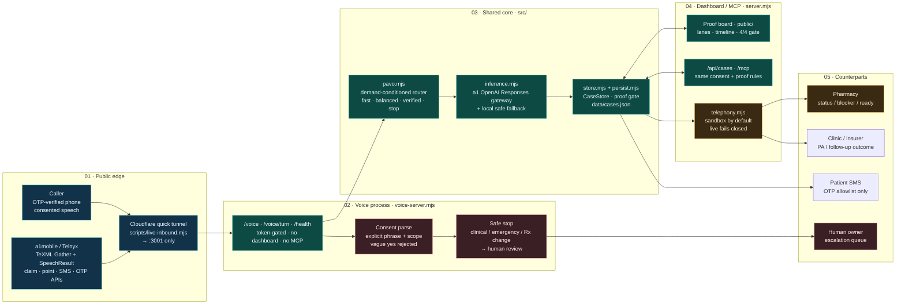

# RxRelay — detailed architecture diagram

This is the large system diagram used in the pitch deck (slide 08) and the GitHub README.



## Proof gate (non-negotiable)

```text
explicit consent  ∧  permitted action  ∧  counterpart outcome  ∧  patient update
        │                    │                     │                     │
   voice/web record    provider-accepted      pharmacy/clinic       consented SMS
                       (sandbox or live)         recorded
                              └─────────────────────┬─────────────────────┘
                                                    ▼
                                          Resolution verified
```

## Trust rules

1. A public tunnel may only reach `voice-server.mjs` (`/voice`, `/voice/turn`, `/health`).
2. Evidence flags are set by state transitions — never by model output.
3. Live outbound requires OTP-verified `LIVE_ALLOWED_RECIPIENTS` and a provider action id.
4. Safe-stop / human-review blocks autonomous outreach.
